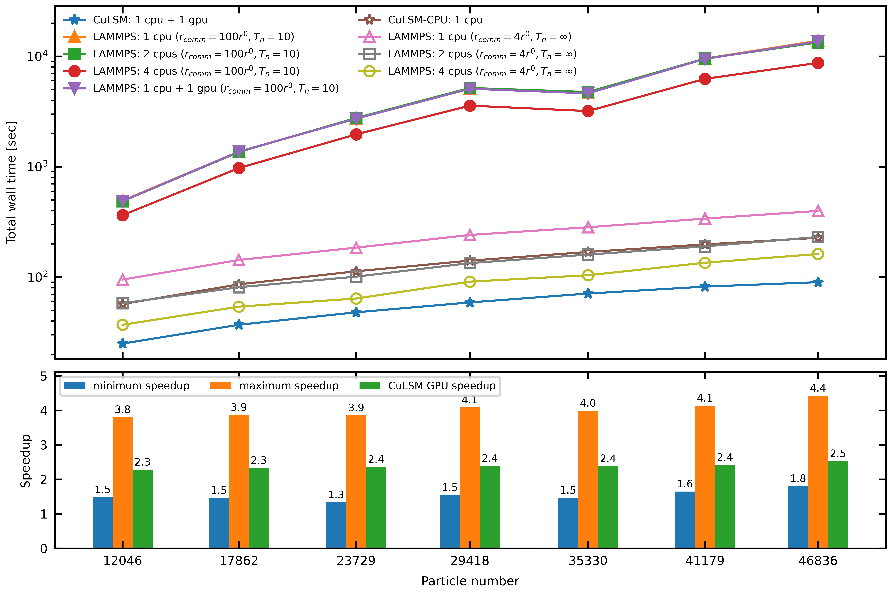

# CuLSM

**Cuda-accelerated lattice spring model (CuLSM)** is the CUDA C++ code implementing GPU parallelization on particle and spring lists. The code is associated with the paper "[ImageMech: From Image to Particle Spring Network for Mechanical Characterization](https://www.frontiersin.org/articles/10.3389/fmats.2021.803875/full)" published in [Frontiers in Materials](https://www.frontiersin.org/journals/materials). 

If you happen to use this code in your work, please cite:

> Chiang Y, Chiu T-W and Chang S-W (2022) ImageMech: From Image to Particle Spring Network for Mechanical Characterization. *Front. Mater.* 8:803875. doi: 10.3389/fmats.2021.803875

Instead of spatial decomposition as used in [LAMMPS](https://www.lammps.org/), CuLSM applies parallization to atom and bond lists and therefore secures remarkable speedup for large-scale lattice spring model simulations.



## Prerequisites

- GPU compute capabtility > 6.x for 64-bit floating point operation
- CUDA Toolkit >= 10.1 recommended

## Build

To buld `culsm` on your device, GPU architecture must be specified at the time of compilation. In `build/Makefile`, make sure the `NVFLAGS` fit your device. 

```shell
NVFLAGS = 	-O3 -I$(CUDIR)/include -m64 -arch=compute_75 -code=sm_75 -Xptxas -v -rdc=true
```

The GPU architecture (*e.g.* Kepler, Turing, *etc*.) may be found [here](https://en.wikipedia.org/wiki/CUDA#GPUs_supported), and the cooresponding CUDA naming scheme can be found in [Nvidia GPU Feature List](https://docs.nvidia.com/cuda/cuda-compiler-driver-nvcc/index.html#gpu-feature-list).

To compile the code, enter `build` directory and simply execute make in the terminal.

```shell
cd build
make
```

## Usage

```shell
./culsm < [input] > [output] &
```

## Example Command Script

```
read_data       <file>

mass            <type> <mass>

bond            <type> <bond type> <coeff 1> <coeff 2> ... <coeff n>

fix             <type> <disp x> <disp y> <disp z>

dump            <file name> <timesteps>

thermo          <timesteps>

run             <dt> <timesteps>
```
